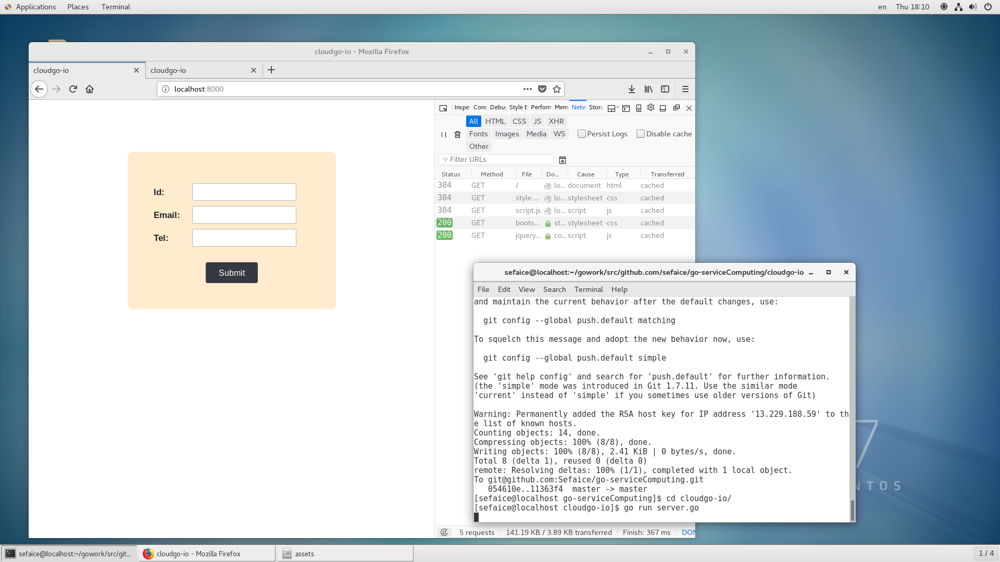
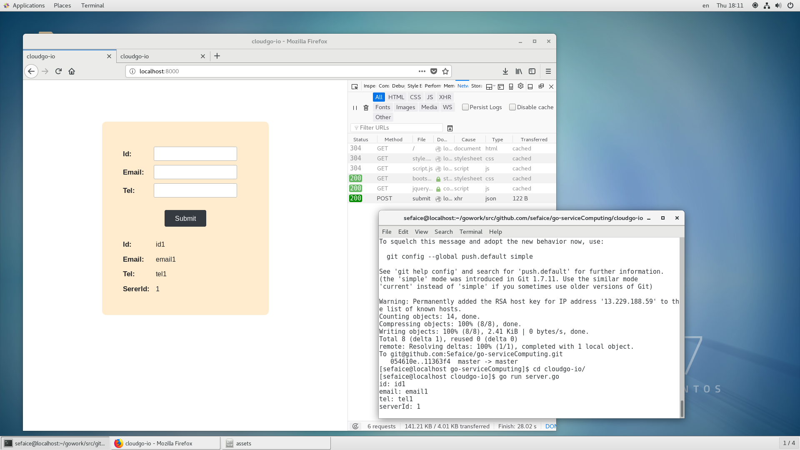
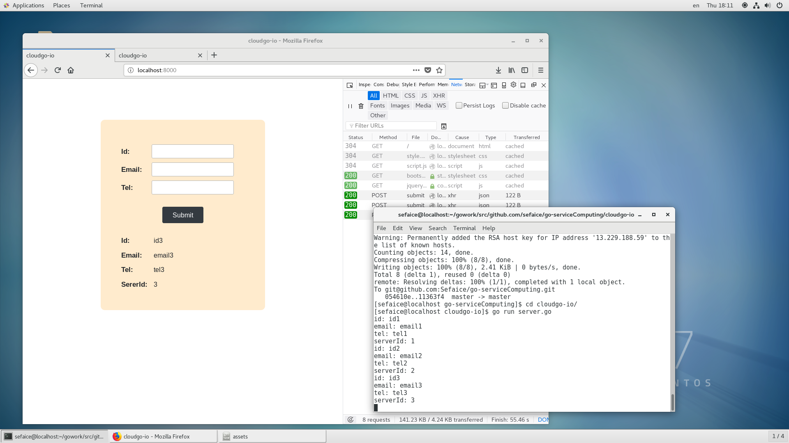
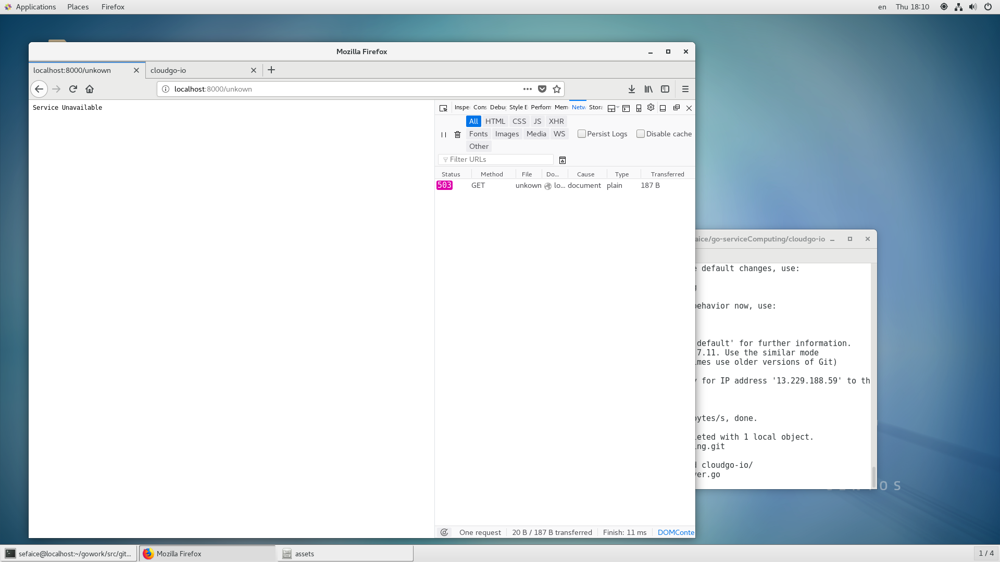

# Cloudgo-io

[作业要求](https://pmlpml.github.io/ServiceComputingOnCloud/ex-cloudgo-inout)

我实现了静态文件服务，ajax交互和简单的路由解析。server.go是golang编写的服务器端程序，assets下是一个静态页面的组件。

### go实现服务器过程

只用了go自带的http包进行实现，服务器首先设定解析静态文件：
```
http.Handle("/", http.FileServer(http.Dir("./assets")))
```

然后是对ajax的post表单数据进行解析：
```
http.HandleFunc("/submit", submitHandler)
```

```
func submitHandler(w http.ResponseWriter, r *http.Request) {
	// 解析参数，默认是不会解析的
	r.ParseForm()
	if r.Method == "POST" {
		var user map[string]interface{}
		body, err := ioutil.ReadAll(r.Body)
		if err == nil {
			serverId += 1
			json.Unmarshal(body, &user)
			fmt.Println("id:", user["id"])
			fmt.Println("email:", user["email"])
			fmt.Println("tel:", user["tel"])
			fmt.Println("serverId:", serverId)

			// response json
			resData := map[string]int{"serverId": serverId}
			resJson, err := json.Marshal(resData)
			if err != nil {
				http.Error(w, err.Error(), http.StatusInternalServerError)
				return
			}
			w.Header().Set("Content-Type", "application/json")
			w.Write(resJson)
		}
	}
}
```

其中，由于前端发来的POST数据设定了application/json格式，所以要先解析json字符串，golang有自带方法，返回json时先把数据放在map对象中，然后转换为json数据发送即，为了体现和服务器交互的作用，我用了一个全局变量serverId记录提交次数，每次提交后都加一返回给前端，可见最后测试图。

最后一个路由是对/unkown解析，如果老师要求的意思是对非法路由统一处理的话，需要手动补充DefaultServeMux。

前端就是基本的html-css-js，其中css用到了bootstrap简化排版，js用到了jquery，不再赘述。

### 结果

静态文件：


ajax表单交互：



非法处理：

